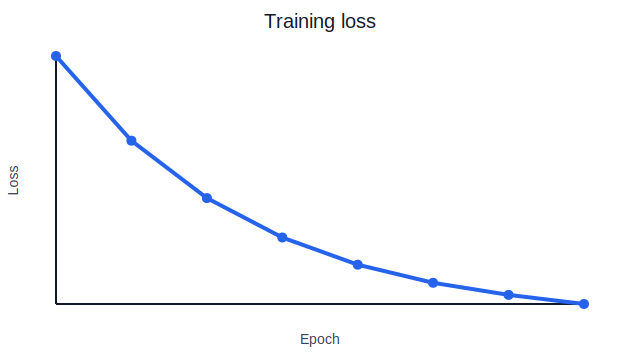

# Generated Plot

This example writes a plot image from ordinary Python code, then uses a
MathDocs directive to place that generated artifact in the rendered document.

_Loss decreases over eight training epochs._

$$
\operatorname{final}_{loss} = 0.18
$$
